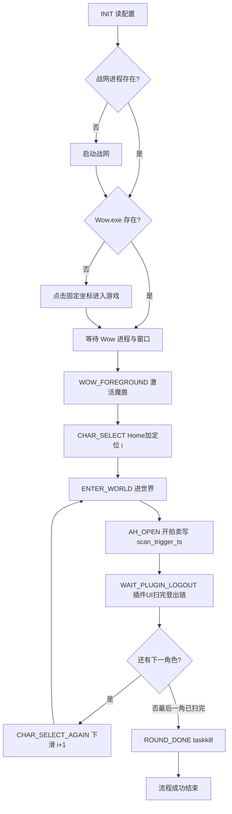

# 自动化全流程与异常处理矩阵

本文与 [DEVELOPMENT_PLAN.md](DEVELOPMENT_PLAN.md) 配套：**主流程（成功路径）** + **异常情况、如何发现、如何处理、边界条件**。  
实现时 **Go FSM** 与 **插件** 分工以本文为准。

---

## 1. 参与者与假设

| 参与者 | 职责 |
|--------|------|
| **Go（wow-runner）** | 进程、战网点击、窗口前台、**tar 宏 + 交互键**（`AH_OPEN`）、截图/模板、**插件 UI + 登出 UI** 多步模板与点击、FSM、日志、杀进程与全流程重启 |
| **插件** | Replicate、SavedVariables；**开拍卖后自动** 出监控 UI 并扫；扫完后 **登出用自定义 UI**（**无直接 `logout` API**）；**返回角色**由 Go **模板 + 点击** 完成 |
| **人** | 战网已登录；固定分辨率/缩放；首版不调战网账号密码 |

**假设**：单显示器或战网/魔兽始终在可截图区域；固定 **全屏无边框（魔兽）+ 全屏（战网）**。本自动化 **仅在非战斗** 下跑拍卖与登出（**不在战斗状态**），**SecureActionButton** 等与战斗相关的限制 **首版不作为风险项**。

---

## 2. 状态识别策略：OpenCV 模板与颜色为主，超时兜底

在**固定分辨率 + 固定系统缩放 + 战网/魔兽均全屏**的前提下，**状态迁移以模板匹配（实现为 Go 侧 NCC 等 + 可选颜色门控）** 为主；文档中「OpenCV」指同类判据，**不必**绑定 OpenCV C++ 运行时。各状态 **轮询截图** 直至判据满足或触达 **最大等待**；超时走 **§4 异常总览 / §5 核心异常** 策略。

### 2.1 战网

| 目标状态 | 识别思路（ROI、模板以实机校准为准） |
|----------|-------------------------------------|
| 战网已打开 | 进程存在 + ROI **模板/布局特征** |
| 可点击「进入游戏」 | **模板或颜色**：按钮为**可点**（与「灰显」区分） |
| 已点击、等待启动魔兽 | **进入游戏** 变为**灰显/不可点**（表示已发起启动） |
| 广告/异常遮挡 | 非正常主界面 → **Alt+F4** → 重新识别；仍异常可重试或 `FAILED` |
| 魔兽进程已起 | **`Wow.exe` 进程存在**（与视觉并行） |
| **仅有 Wow、无战网进程** | **规范**：须从战网「进入游戏」进魔兽；**Go（wow-runner）** 会 **终止全部 `Wow.exe`** 后从战网流程重试（见 `DEVELOPMENT_PLAN` 与 `config.example.yaml` 注释） |

### 2.2 选角界面

| 目标状态 | 识别思路 |
|----------|----------|
| 已在选角 | 固定 ROI **模板**（或局部文字 OCR 辅助）；**ROI 须与战网区分** |
| 尚未在选角 | 不匹配则不发选角键序 |

**选角操作（与 [DEVELOPMENT_PLAN.md §4](DEVELOPMENT_PLAN.md) 一致）**：**首轮进流程**与 **异常杀进程后全流程重启** → **Home 回顶再定位**；**插件正常小退回到选角后换下一角** → 列表 **顺序相邻**，**每次按一次 ↓** 到下一角色，**不再 Home**。

### 2.3 游戏内

| 目标状态 | 识别思路 |
|----------|----------|
| 已进世界可操作 | **配置项**：「进世界判定」按键 + **该键在动作条上的 ROI 模板/颜色**；与选角模板 **互斥** |
| 已开拍卖（可选） | 拍卖行 UI 的 ROI **模板** |

### 2.4 插件 UI：拍卖打开后自动出现与扫描状态（模板 **插件 UI 定稿后** 标定）

**无单独「打开插件主面板」热键**。流程为：**配置键发送 `/tar` 拍卖行 NPC 宏** → **配置交互键打开拍卖行**（与 [DEVELOPMENT_PLAN.md §6.1](DEVELOPMENT_PLAN.md) 一致）→ 插件 **自动** 触发扫描并 **显示** 监控用 UI。**监控与完成判定**在 **插件自有 UI** 上完成（**不读内存、不接 Lua 回调**，**仅截屏 + 模板**）。

| 动作 / 状态 | 说明 |
|-------------|------|
| **出现插件 UI** | **开拍卖后自动**（由上述宏 + 交互触发），**无需** Go 再发第二颗「开面板」键。 |
| **已开始扫描 / 扫描中** | 插件 UI **展示相应状态**（文案或控件）；Go 为各态配置 **ROI + 模板**（定稿后截取）。 |
| **扫描完成** | 以 **插件 UI 上出现「扫描完成」类模板** 为准，再进入 **§2.5 登出点击链**。 |

**模板清单与 ROI**：**插件 UI 定稿后**再定。

### 2.5 登出 UI 与返回角色（`WAIT_PLUGIN_LOGOUT` 主体内）

**环境不支持插件直接调用 Blizzard `logout`**。扫描完成后插件 **展示登出用自定义 UI**（可与 §2.4 同窗体或分步）；**Go** 用 **OpenCV 模板**（及 ROI）识别 **UI 内各状态**（按钮可点、确认框等），**按序 SendInput 点击**，直至回到选角。

| 目标状态 | 识别思路 |
|----------|----------|
| 登出 UI 某步就绪 | 对应 **模板/颜色** 满足后再发送 **点击/按键** |
| 已回到选角 | **§2.2 选角界面** 判定成功 |

子步骤数量与模板 **上机标定**；实现见 [DEVELOPMENT_PLAN.md §4.1](DEVELOPMENT_PLAN.md)。

### 2.6 总超时计时（与 §2.4、§2.5 并行）

**不读内存**；进度与完成以 **屏上模板** 为准。**唯一总死线起点** **`scan_trigger_ts`**：**`AH_OPEN` 成功**（拍卖已打开）。从 `scan_trigger_ts` 起若在 **`max_wait_since_scan_trigger`** 内仍未识别 **选角**（含 **插件 UI 上长期无「扫描完成」**、或 **§2.5 登出链** 未完成）→ **§5**（杀进程、全流程重来、**同角色索引**）。

**说明**：同一「进入游戏」类界面可能出现在战网与选角，**必须靠不同 ROI / 辅助特征** 区分，避免误判。

---

## 3. 成功路径（主流程）

**推进方式**：在各状态内 **轮询截图 → 模板/颜色** 直至成功判据满足或触达 **最大等待**；「等待选角」的 **总死线** 从 **`scan_trigger_ts`** 起算（见 §2.6）；**插件面板上的扫描开始/完成** 见 §2.4；**登出 UI** 见 §2.5。

**文字版（与上图一致）**

1. **INIT**：加载配置（坐标、超时、**角色列表与扫描模式**、**拍卖 tar 宏键 + 交互键**、各 ROI、**`max_wait_since_scan_trigger`**、重试上限）。
2. **战网**：若无战网进程则启动；若 **无 Wow** 则点击「进入游戏」；若 **已有 Wow** 则跳过点击。
3. **前台**：激活魔兽窗口。
4. **选角（首轮 / 杀进程重启后）**：**Home** + 定位到 **角色[i]**（`CHAR_SELECT`）。
5. **进世界**：发送进入游戏；**§2.3 配置的进世界按键 ROI 模板** 确认已进世界。
6. **开拍卖（`AH_OPEN`）**：**tar 宏** 选中拍卖 NPC → **交互键** 打开拍卖；**无单独「开插件面板」键**，打开后插件 **自动** 出 UI 并扫；**`AH_OPEN` 成功时写入 `scan_trigger_ts`**（见 [DEVELOPMENT_PLAN.md §6.1](DEVELOPMENT_PLAN.md)）。
7. **等选角（`WAIT_PLUGIN_LOGOUT`）**：在 **已自动出现的插件 UI** 上（§2.4）用模板确认 **已开始扫描 → 扫描完成**；再 **§2.5 登出 UI 模板 + 点击** 直至 **§2.2 选角**。总时间 **`now - scan_trigger_ts` ≤ `max_wait_since_scan_trigger`**（§2.6）。**无直接 logout API**（见开发计划 §7）。
8. **循环**：若 **还有下一角色** → **`CHAR_SELECT_AGAIN`**：**按一次 ↓** → 回到步骤 5；若 **最后一角已扫完且已在选角** → **`taskkill` Wow**（§1 已定稿）。**异常全流程重启后**再进选角 → 回到步骤 4（**Home + 定位**）。
9. **结束**：日志记录成功，进程退出码 0。

---

## 4. 异常总览（按阶段）

| 阶段 | 可能问题 | 典型检测方式 | 处理策略 |
|------|----------|----------------|----------|
| 战网 | 启动失败、路径错误 | 进程 + 视觉长时间不满足 | 重试 N 次 → `FAILED` |
| 战网广告 | 进入游戏不可点、界面异常 | 模板非预期 | **Alt+F4** → 重新识别；仍失败 → `FAILED` 或人工 |
| 进游戏 | 点击无效、排队 | 无 Wow；可选模板「队列」 | 延长 **最大等待** 或 `FAILED` 人工 |
| 前台 | 窗口找不到 | 无 HWND | 重试激活 → `FAILED` |
| 选角 | 键序错、配置与列表不一致 | **长时间非选角模板** | Esc 回退 + 重试；仍失败 → 杀进程全流程 + **同索引重试** |
| 进世界 | 卡蓝条、掉线 | **长时间无 §2.3 进世界 ROI 模板** | Esc/重试；或杀进程全流程重试 **同角** |
| 开拍卖 | 宏未触发、NPC 距离不对 | **无拍卖 UI 模板** | Esc + 重发宏；计数用尽 → 同「杀进程重试」或 `FAILED` |
| 等插件小退 | 插件 UI 无「完成」/ 登出链卡 / 未回选角 | **`now - scan_trigger_ts` 超阈值**（§2.6） | **杀 Wow → 全流程再起 → 同角色索引重试**（见 §5） |
| 最后一角结束 | 需关客户端 | — | **`taskkill` Wow** |
| 全局 | 无限重试 | 计数器 | **每角最大重试**、**全局最大杀进程次数** → `FAILED` |

---

## 5. 核心异常：`WAIT_PLUGIN_LOGOUT` 超时（选角界面迟迟不出现）

**现象**：自 **`scan_trigger_ts`**（**`AH_OPEN` 成功**，见 §2.6）起，在 **`max_wait_since_scan_trigger`** 内：**选角界面**（§2.2）未出现，或 **插件 UI 上「扫描完成」**（§2.4）长期不匹配，或 **登出 UI 链**（§2.5）未完成。

**说明**：**不读内存**；扫描进度仅以 **插件 UI 模板** 为准。超时即视为「本角未完成」，走下列恢复。

**可能原因**（不要求自动区分，统一走恢复策略即可）：

- **插件 UI** 上长期无 **「扫描完成」** 模板，或 **登出 UI** 某步不匹配；
- 游戏掉线、卡界面、拍卖行未关；
- 扫描极慢仍进行中（**`max_wait_since_scan_trigger`** 应覆盖大服）；
- 客户端崩溃。

**已定稿解决方案**：

1. 记日志：`PLUGIN_STUCK`，附 **`scan_trigger_ts`**、**`deadline_ts`**（或等价）、当前 **角色索引**、截图路径（若开启调试落盘）。
2. **终止 `Wow.exe` 进程**（整进程结束）。
3. **从 `BNET_START` 等价步骤重新跑**：战网 →（若需）点进入游戏 → 选角 → …  
4. **角色索引不变**，对 **当前角** 重试；**不**进入「下一角色」。
5. 若该角累计失败次数 ≥ **`max_retries_per_character`**，或全局杀进程次数 ≥ **`max_kill_restart_total`** → **`FAILED`**，退出码非零，日志说明人工介入。

**明确不做**：该路径下 **不使用 `/reload`** 作为恢复手段。

---

## 6. 其他异常与对策详表

| ID | 异常场景 | 检测 | 解决方案 | 备注 |
|----|----------|------|----------|------|
| E1 | 战网未安装/路径错 | 启动失败、无进程 | 日志 + `FAILED` | 配置校验可前置 |
| E2 | 战网要更新/弹窗挡点击 | 长时间无 Wow | 超时后 `FAILED` 或人工关窗后重跑 | 可扩展模板识别「更新」 |
| E3 | 已开 Wow，误判再点「进入游戏」 | 双开风险 | **以进程为准**：已有 Wow 则**不点** | 已在主流程避免 |
| E4 | 排队登录 | 模板/OCR「队列」或极长等待 | 延长 `ENTER_WORLD` 超时或单独状态 `QUEUE` | 首版可仅加长超时 |
| E5 | 选角键序与列表不一致 | 进错角或进不去 | 模板校验失败 → Esc → 重试键序；失败 → E9 | 换角色顺序需改配置 |
| E6 | 进世界超时（卡蓝条） | `ENTER_WORLD` 超时 | Esc；重试进入；再败 → E9 | |
| E7 | 拍卖 UI 未打开 | `AH_OPEN` 超时 | Esc → 重发宏；重试耗尽 → E9 或 `FAILED` | |
| E8 | 长时间未回选角（无法区分原因） | **`scan_trigger_ts` 超时** 仍非选角模板 | 同 **§5**；可选 **Go 键序兜底**（在超时前尝试，若实现） | 主策略为 §5 |
| E9 | 任意阶段「可恢复」失败耗尽 | 重试计数满 | **杀 Wow → 全流程重启 → 同索引** | 与 **§5** 统一 |
| E10 | 网络断开 | 模板「断开连接」或进程无响应 | 杀进程 + 全流程重试同角；或 `FAILED` | 依赖模板覆盖 |
| E11 | 最后一角结束后未退出 | `ROUND_DONE` 执行失败 | 强制 `taskkill` Wow；日志 | 与「直接退出」一致 |
| E12 | 杀进程后战网状态异常 | 再起 Wow 失败 | 重试战网点击；再败 `FAILED` | |
| E13 | 分辨率/缩放被改 | 模板全不匹配 | 快速连续失败 → `FAILED` 提示检查显示设置 | 首版人工保证固定 |

---

## 7. 备选路径（登出 UI 不可用或模板失败时）

1. **主路径**：**tar 宏 + 交互开拍卖 → 插件 UI 自动出现 → 模板确认扫描完成 → 登出 UI 模板链 + 点击**（§2.4–§2.5、[DEVELOPMENT_PLAN.md §4.1](DEVELOPMENT_PLAN.md)）。
2. 插件内若 **UI 创建失败**：**打印明确日志**。
3. Go：**不依赖** Lua 回调；超时仍以 **`scan_trigger_ts` + 最终选角模板** 为准。
4. 可选：在超时前使用配置的 **备选键序**（Esc → 菜单 → 返回角色等）**尝试**一次或数次。
5. 若仍失败 → **§5**（核心异常恢复）。

---

## 8. 日志、状态记录与退出码

**实现要求**：全流程 **日志与状态记录须完整**，便于端到端测试与事后对照；**不得静默吞错**。详细字段、`event` 类型清单、错误结构与自测清单见 **[LOGGING_SPEC.md](LOGGING_SPEC.md)**。

### 8.1 退出码

| 退出码 | 含义 |
|--------|------|
| 0 | 全部角色成功扫完并已退出魔兽 |
| 1 | 配置错误 |
| 2 | 达到重试/杀进程上限 |
| 3 | 用户中断（若实现 Ctrl+C） |
| 其他 | 保留 |

### 8.2 最小约定（摘要）

- **格式**：默认 **NDJSON**（一行一条 JSON），`ts` 为 RFC3339；见 `LOGGING_SPEC.md` §2–§3。
- **状态**：每个 FSM 状态须有 **`state_enter` / `state_exit` 或 `transition`**（与 `DEVELOPMENT_PLAN.md` §4 状态 ID 一致）。
- **计数器**：`kill_wow_total`、各重试计数等变更时须落日志（见 `LOGGING_SPEC.md` §4）。
- **`scan_trigger_ts`**：写入与 **`scan_trigger_recorded`** 事件须可追溯（见 `LOGGING_SPEC.md` §5.6）；计时语义见 §2.6。
- **错误**：结构化 `error.code`（含 E1–E13、`PLUGIN_STUCK` 等），与 §6 矩阵可对应。

---

## 9. 与开发计划交叉引用

- FSM 状态表：[DEVELOPMENT_PLAN.md §4](DEVELOPMENT_PLAN.md)
- 插件任务：[DEVELOPMENT_PLAN.md §7](DEVELOPMENT_PLAN.md)
- **日志规范**：[LOGGING_SPEC.md](LOGGING_SPEC.md)
- 实现目录：`automation/wow-runner/`（待建）

---

**维护说明**：新增异常时在本文件 **§6 详表** 增一行，并同步 **[LOGGING_SPEC.md](LOGGING_SPEC.md) §7**（`code` 枚举）；视情况改 Go 的 FSM 与配置项。
